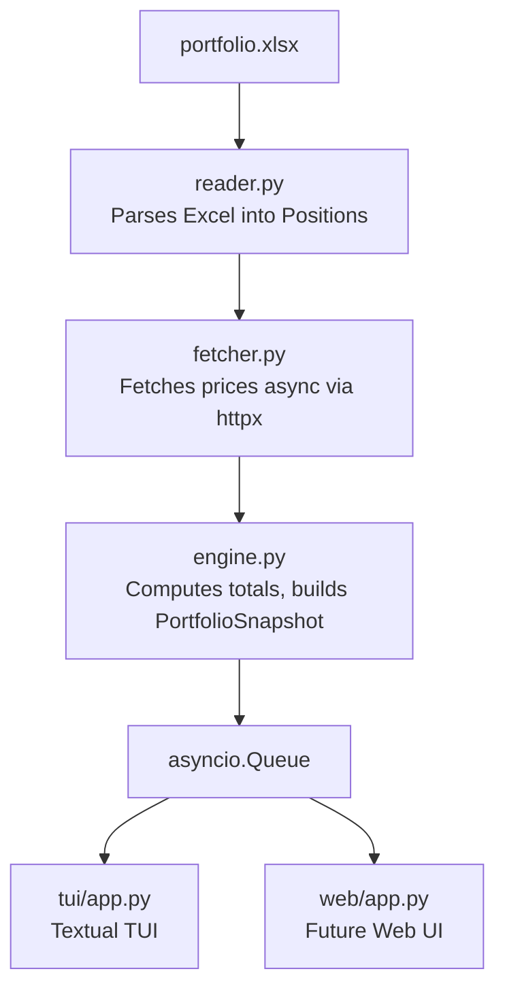
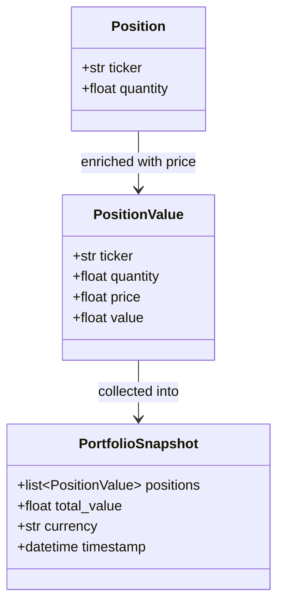

# Portfolio Tracker

A near-real-time terminal dashboard that reads your stock holdings from an Excel
file and displays their current market value, refreshed automatically.

---

## Architecture

### Data Pipeline

Data flows in one direction: from your Excel file, through price fetching, into a
queue that feeds any number of UI consumers independently.



### Data Models

The app uses three Pydantic models to represent data at different stages of the
pipeline. `Position` is the raw input from Excel. It gets enriched with a live
price into `PositionValue`, and a collection of those is bundled into a
`PortfolioSnapshot` that gets pushed to the queue on every refresh cycle.



---

## Requirements

- Python 3.12 or higher
- [uv](https://docs.astral.sh/uv/) package manager

### Installing uv (if not already installed)

```bash
curl -LsSf https://astral.sh/uv/install.sh | sh
```

Then restart your terminal, or run:

```bash
source $HOME/.local/bin/env
```

---

## Setup

1. **Clone or download this project**, then navigate into the folder:

   ```bash
   cd portfoliotracker
   ```

2. **Install dependencies:**

   ```bash
   uv sync
   ```

3. **(Optional) Configure settings** by copying the example env file:

   ```bash
   cp .env.example .env
   ```

   Edit `.env` to change the Excel file path or refresh interval:

   ```
   EXCEL_PATH=data/portfolio.xlsx
   REFRESH_INTERVAL_SECONDS=30
   ```

---

## Adding tickers to the Excel file

The tool reads from `data/portfolio.xlsx` by default. The file must follow this
structure:

| Column A   | Column B | Column C  | Column D |
|------------|----------|-----------|----------|
| Ticker     | Quantity | Exchange  | Category |
| AAPL       | 10       | NASDAQ    | Stock    |
| PETR4.SA   | 100      | B3        | Stock    |
| HGLG11.SA  | 50       | B3        | FII      |
| SAP.DE     | 20       | Frankfurt | Stock    |

**Rules:**

- **Row 1 is a header row** — it is skipped automatically. Labels do not matter.
- **Column A** — stock ticker symbol in Yahoo Finance format (see suffixes below).
  Must be a valid Yahoo Finance ticker.
- **Column B** — number of shares (or units) you hold. Must be greater than 0.
  Decimals are supported (e.g. `0.5` for half a share).
- **Column C** — exchange name for display purposes only (e.g. `NASDAQ`, `B3`,
  `Frankfurt`). Optional — leave blank if not needed.
- **Column D** — asset category for display purposes only (e.g. `Stock`, `FII`,
  `ETF`, `Crypto`). Optional — leave blank if not needed.
- Blank rows are ignored.

### Ticker format by exchange

Yahoo Finance uses suffixes to identify the exchange. The ticker in column A must
include the correct suffix for non-US assets:

| Exchange | Suffix | Example |
|---|---|---|
| NASDAQ / NYSE (US) | *(none)* | `AAPL`, `MSFT` |
| B3 (Brazil) | `.SA` | `PETR4.SA`, `VALE3.SA`, `HGLG11.SA` |
| Frankfurt / XETRA | `.F` or `.DE` | `BMW.F`, `SAP.DE` |
| London Stock Exchange | `.L` | `HSBA.L` |
| Crypto (USD) | `-USD` | `BTC-USD`, `ETH-USD` |

### Example tickers

| Asset | Ticker | Exchange | Category |
|---|---|---|---|
| Apple | `AAPL` | NASDAQ | Stock |
| Microsoft | `MSFT` | NASDAQ | Stock |
| Petrobras PN | `PETR4.SA` | B3 | Stock |
| Vale ON | `VALE3.SA` | B3 | Stock |
| CSHG Logística FII | `HGLG11.SA` | B3 | FII |
| SAP SE | `SAP.DE` | Frankfurt | Stock |
| Bitcoin | `BTC-USD` | — | Crypto |
| S&P 500 ETF | `SPY` | NASDAQ | ETF |

> Prices are sourced from **Yahoo Finance** via `yfinance`. Any ticker that works
> on finance.yahoo.com should work here, including ETFs, FIIs, and crypto pairs.

### How to edit the file

Open `data/portfolio.xlsx` with any spreadsheet application (Excel, LibreOffice
Calc, Numbers) and edit the rows. Save the file before launching the tracker —
it re-reads the file on each refresh cycle.

---

## Importing positions from a broker export (B3)

Instead of editing quantities by hand, you can sync them automatically from a
**B3 "posição" export** — the multi-sheet `.xlsx` you download from your broker's
investor area (filename looks like `posicao-2026-07-11-11-28-57.xlsx`).

```bash
# 1. Preview the changes without writing anything:
uv run portfolio import posicao-2026-07-11-11-28-57.xlsx --dry-run

# 2. Apply them (asks for confirmation first):
uv run portfolio import posicao-2026-07-11-11-28-57.xlsx
```

The importer reads the export, matches each ticker against your portfolio
(`ITSA4` in the export ↔ `ITSA4.SA` in the file), and updates the quantities to
match. It shows a plan and waits for your confirmation before writing.

### What it reads

Quantities are **summed across every tradable sheet** — `Acoes`, `Empréstimos`
(lent shares still count as yours), `ETF`, and `Fundo de Investimento`. The
`Renda Fixa` and `Tesouro Direto` sheets are skipped, since those have no market
ticker (track them in the `FixedIncome` sheet instead).

### Options

| Flag | Description |
|---|---|
| `--dry-run` | Show the plan but write nothing. |
| `-y`, `--yes` | Apply without the interactive confirmation prompt (for scripts). |
| `--add-new` | Also add tickers found in the export but missing from your portfolio. |
| `--portfolio PATH` | Portfolio file to update (default: the configured `EXCEL_PATH`). |

### Example output

```
Portfolio import — posicao-2026-07-11-11-28-57.xlsx
Target: data/portfolio.xlsx

Quantity updates (6):
  FLRY3.SA   1760 -> 2060
  HYPE3.SA   1253 -> 1453
  KLBN11.SA  1515 -> 2715
  BBAS3.SA   1390 -> 1590
  B5P211.SA  100 -> 147
  JURO11.SA  260 -> 360

New tickers in export (2):
  RECR12.SA  qty 47  [Fund]  — skipped (use --add-new to add)
  URPR12.SA  qty 432  [Fund]  — skipped (use --add-new to add)

Unchanged (already correct): 35
In portfolio but not in export (2, left untouched): BTC-USD, SAP.DE

Apply these changes? [y/N]
```

### Safety

- **Preview first** — nothing is written until you confirm (or pass `--yes`).
- **Never removes** — tickers in your portfolio but absent from the export (e.g.
  non-B3 assets like `SAP.DE` or `BTC-USD`) are reported and left untouched.
- **Additions are opt-in** — new tickers are only added with `--add-new`.
- **Non-destructive to your data** — only the `Quantity` cells change; your
  `Average Price` column, other rows, and the `FixedIncome` sheet are preserved.

---

## Running the tracker

```bash
uv run portfolio
```

The terminal dashboard will launch. It shows a table with each position's
current price, quantity, and total value, plus a running portfolio total at the
bottom.

| Column | Description |
|---|---|
| Ticker | Stock symbol (with exchange suffix where applicable) |
| Exchange | Exchange name as entered in the Excel file |
| Category | Asset category as entered in the Excel file |
| Quantity | Number of shares held |
| Price | Latest market price |
| Value | Quantity × Price |

Prices refresh automatically every 30 seconds (or whatever is set in `.env`).

**Keyboard shortcuts:**

| Key | Action |
|---|---|
| `q` | Quit the application |
| `h` | Hide / show values (privacy mode) |
| `e` | Cycle the exchange filter |
| `c` | Cycle the category filter |
| `escape` | Collapse the expanded detail row |
| `p` / `v` / `n` | Sort by P&L / Value / Name |
| `d` / `w` | Sort by 24h / 1-week change |
| `u` | Edit the selected position's quantity |
| `P` | Edit the selected position's average price |
| `A` | Add a new position |
| `D` | Delete the selected position |

> Editing keys (`u`, `P`, `A`, `D`) write straight to `data/portfolio.xlsx` and
> the table refreshes within a second. `P`, `A`, and `D` use capital letters
> (Shift+key); `u` works with or without Shift.

---

## Running the tests

```bash
uv run pytest tests/unit/ -v
```

---

## Troubleshooting

**"No price returned for TICKER"**
The ticker symbol is not recognised by Yahoo Finance. Double-check the symbol
at finance.yahoo.com.

**"Failed to parse data/portfolio.xlsx"**
The Excel file is missing, open in another application with a write lock, or
does not follow the expected column layout. Close the file in other apps and
verify columns A (Ticker) and B (Quantity) are populated from row 2 onward.
Columns C (Exchange) and D (Category) are optional.

**Prices are stale**
The refresh interval is controlled by `REFRESH_INTERVAL_SECONDS` in `.env`.
Lowering this value (e.g. to `10`) will fetch prices more frequently, but may
trigger Yahoo Finance rate limits.
